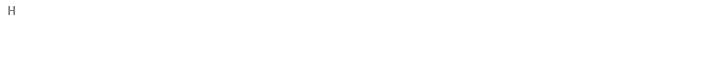

# Hi there 👋

<!--
**Bok-hyeonu/Bok-hyeonu** is a ✨ _special_ ✨ repository because its `README.md` (this file) appears on your GitHub profile.

Here are some ideas to get you started:

- 🔭 I’m currently working on ...
- 🌱 I’m currently learning ...
- 👯 I’m looking to collaborate on ...
- 🤔 I’m looking for help with ...
- 💬 Ask me about ...
- 📫 How to reach me: ...
- 😄 Pronouns: ...
- ⚡ Fun fact: ...
-->

```python


class DataScientist:
    def __init__(self):
        self.name = "Hyeonwoo Bok"
        self.role = "Data Scientist"
        self.age = "26"
        self.major = "statistics"

    def say_hi(self):
        print(f'Hi! My name is {self.name}.')
        print(f'I\'m a {self.age}-year-old bachelor\'s student in {self.major} who wants to become a {self.role}.')
        print("Thanks for dropping by, hope you find some of my work interesting.")

me = DataScientist()
me.say_hi()
```



## 🗞️ Certificates

|            자격명             |     취득일     |            주관기관            |
| :---------------------------: | :------------: | :----------------------------: |
|     **빅데이터분석기사**      | **2023.07.14** |    **한국데이터산업진흥원**    |
|       **정보처리기사**        | **2023.11.15** |      **한국산업인력공단**      |
|       **품질경영기사**        | **2023.06.09** |      **한국산업인력공단**      |
| **[ADsP] 데이터분석준전문가** | **2023.06.16** |    **한국데이터산업진흥원**    |
|     **[SQLD] SQL 개발자**     | **2023.10.06** |    **한국데이터산업진흥원**    |
|    **사회조사분석사 2급**     | **2022.06.17** |      **한국산업인력공단**      |
|    **삼성SW역량평가 A형**     | **2024.03.04** | **삼성청년소프트웨어아카데미** |

## 🌎 Language

- **`TOEIC 845 (2022.09.04)`**
- **`OPIC IM1 (2024.06.14)`**

## 🔧 Technologies & Tools


  


  

  


## 💻 Project

- **`[DA/DACON] Online channel product sales amount prediction AI online hackathon Phase 2 (온라인 채널 제품 판매량 예측 온라인 AI 해커톤) 8/747 상위 2%`**

  - [레포지토리 보러 가기](../../../Aimers3rdOnline)
  - [Dacon link](https://dacon.io/competitions/official/236129/overview/description)

- **`[DA/DACON] Online channel product sales amount prediction AI offline hackathon Phase 2 (온라인 채널 제품 판매량 예측 오프라인 AI 해커톤 본선, 주최: LG AI research) 10/43`**

  - [Dacon link](https://dacon.io/competitions/official/236156/overview/description)

- **금융상품 추천 프로젝트(금상추)**
  - [레포지토리 보러 가기](https://github.com/kimbok2/golden-lettuce)

## 📫 contact

[](https://solved.ac/bhw0930)
<a href="mailto:bhwoo1001@naver.com"></a><!--Naver-->
